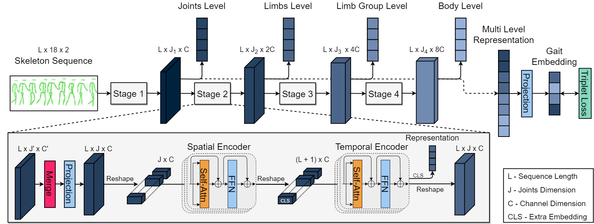
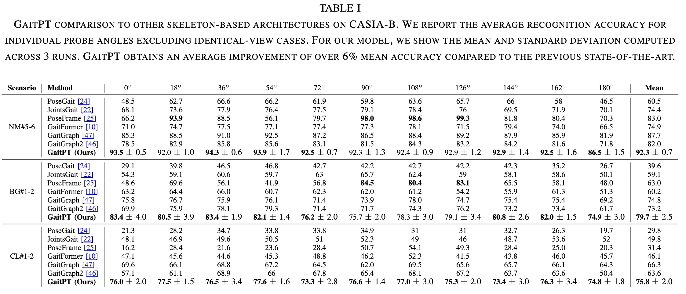
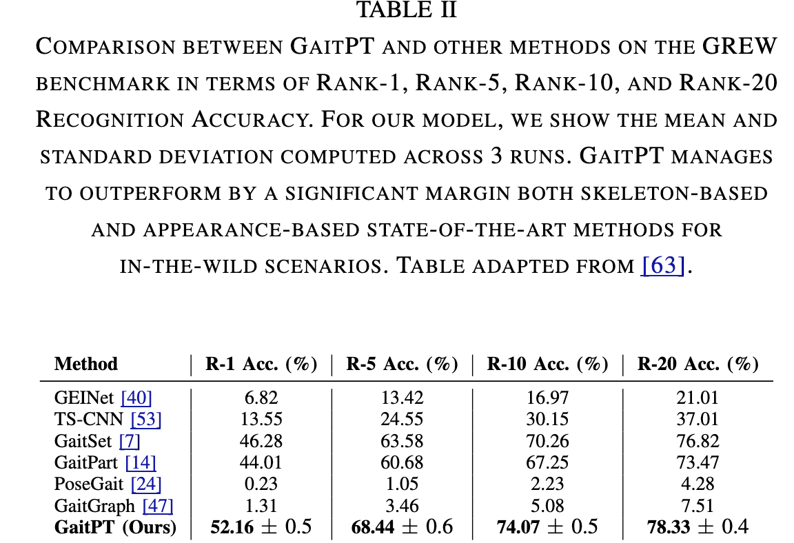
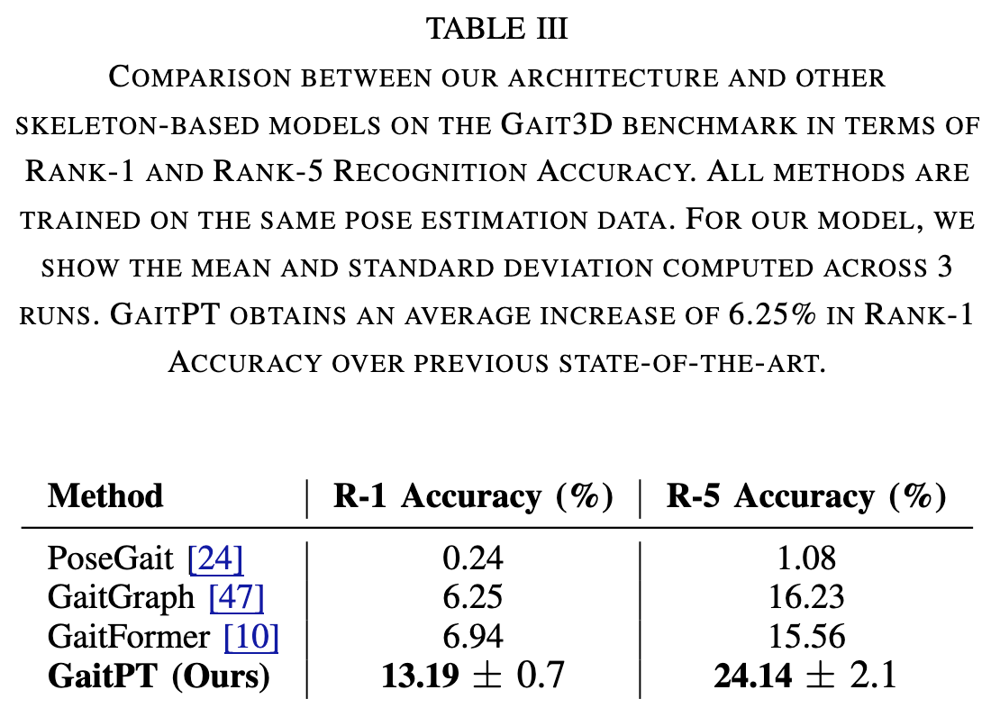

<style>
.column {
  float: left;
  width: 50%;
  padding: 5px;
}

/* Clear floats after image containers */
.row::after {
  content: "";
  clear: both;
  display: table;
}
</style>

<h1 align="center"><span style="font-weight:normal">GaitPT: Skeletons Are All You Need For Gait Recognition</h1>
<h3 align="center"><span style="font-weight:normal">Accepted at: The 18th IEEE International Conference on Automatic Face and Gesture Recognition </h3>

<p align="center"> <a href="https://arxiv.org/pdf/2308.10623"> 📘 Paper PDF </a> | <a href=""> 🪧 Poster </a> | <a href="https://docs.google.com/presentation/d/1Vz1RStFqZxcaMGtB25U5OJ-VdmRMLnA6qfQFS7-WL2E/edit?usp=sharing"></p>

<div align="center">
<strong> Authors </strong>: <a href="https://scholar.google.com/citations?user=ct7ju7EAAAAJ&hl=en&oi=ao"> Andy Catruna </a>, <a href="https://scholar.google.com/citations?user=cdYk_RUAAAAJ&hl=en"> Adrian Cosma</a>, <a href="https://scholar.google.com/citations?user=yjtWIf8AAAAJ&hl=en">Emilian Radoi </a>
</div>

<div></div>



## <a name="abstract"></a> 📘 Abstract
*The analysis of patterns of walking is an important area of research that has numerous applications in security, healthcare, sports and human-computer interaction. Lately, walking patterns have been regarded as a unique fingerprinting method for automatic person identification at a distance.  In this work, we propose a novel gait recognition architecture called Gait Pyramid Transformer (GaitPT) that leverages pose estimation skeletons to capture unique walking patterns, without relying on appearance information. GaitPT adopts a hierarchical transformer architecture that effectively extracts both spatial and temporal features of movement in an anatomically consistent manner, guided by the structure of the human skeleton. Our results show that GaitPT achieves state-of-the-art performance compared to other skeleton-based gait recognition works, in both controlled and in-the-wild scenarios. GaitPT obtains 82.6% average accuracy on CASIA-B, surpassing other works by a margin of 6%. Moreover, it obtains 52.16% Rank-1 accuracy on GREW, outperforming both skeleton-based and appearance-based approaches.*

## <a name="getting-started"></a> 📖 Getting Started

```
TODO
```

## <a name="results"></a> 📖 Results



<div class='row'>
  <div class='column'>
    
  </div>
  <div class='column'>
    
  </div>

</div>

## <a name="citation"></a> 📖 Citation
If you found our work useful or use our dataset in any way, please cite our paper:

```
@inproceedings{catruna2024gaitpt,
  title={GaitPT: Skeletons Are All You Need For Gait Recognition},
  author={Catruna, Andy and Cosma, Adrian and Radoi, Emilian},
  booktitle={The 18th IEEE International Conference on Automatic Face and Gesture Recognition},
  year={2024}
}
```

## <a name="license"></a> 📝 License

This work is protected by [CC BY-NC-ND 4.0 License (Non-Commercial & No Derivatives)](LICENSE).
